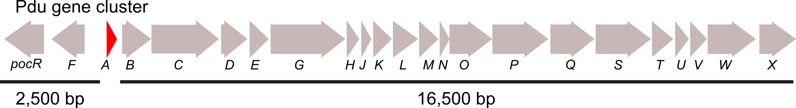

**GeneGrouper** finds gene clusters (genes that are next to each other in the genome) that contain a gene of interest and separates them into groups of gene clusters based on the similarity of their gene content. The goal of GeneGrouper is to allow for understanding how gene content can vary, if only slightly, in up to thousands of similar gene clusters, and how those gene clusters are distributed in genomes.

## Table of contents 

1. **Why use GeneGrouper**

2. **Example application**

3. **Installation**

4. **Usage**

5. **Example dataset and searches**

6. **Output descriptions**

7. **Creating a conda environment with all dependencies**

8. **FAQ**

9. **Citation**

10. **Contact**   

11. **References**


# 1. Why use GeneGrouper?

GeneGrouper searches many genomes for a query gene using BLAST. When GeneGrouper finds a hit, it uses that gene as a seed and extracts the surrounding upstream and downstream genes **(Fig. 1 A-C)**. The extracted regions are then separated into groups of regions that share similar gene content **(Fig. 1 D)**. 

In this way, GeneGrouper can show the user all regions that have different gene content (separated by group), and those that have similar gene content (found within groups) **(Fig. 1 D)**. 

This approach can be used to find whether a specific gene cluster is found in all searched genomes, and whether each gene cluster that is found has all the expected genes, or whether there is unusual gene content.

<br></br>


Figure 1: GeneGrouper overview (A-C). Panel D shows GeneGrouper results after searching 1,130 *Salmonella enterica* genomes for regions containing *pduA* homologs.

<br></br>

# 2. Example application

**Introduction**

We wanted to know whether the catabolic Pdu gene cluster was present in 1,130 *Salmonella enterica*. This gene cluster is made up of 23 genes **(Fig. 2)**. We expected one copy of the intact Pdu gene cluster per genome.

<br></br>



Figure 2. Pdu gene cluster architecture. *pduA* is highlighted in red.
<br></br>

**Methods**

We used GeneGrouper  to search for all occurrences of the *pduA* gene, which is an important component of the Pdu gene cluster. We specified that if *pduA* is found, extract all genes 2,000 bp upstream and 18,000 bp downstream of it **(Fig. 2)**. This should encompass all 23 Pdu gene cluster genes. 

**Results**

We had 2,252 *pduA* hits and the region surrounding each *pduA* gene homolog was extracted as defined above. GeneGrouper separated all 2,252 regions into five different groups according to their gene content. We can see in the output (Fig. 1 D center) that group 0 is composed of 1,120 regions that have the genes we expected to find in the Pdu gene cluster. We can also see how dissimilar the gene content is for each member of each group (Fig. 1 D right). We can also see how the identity and coverage of each *pduA* gene from each member compares to our query gene **(Fig. 1 D left)**. 

Other groups with different gene architectures from the Pdu gene cluster, but containing a *pduA* gene homolog are also present **(Fig. 1D groups 1-3)**. 

**Conclusions**

The group 0 boxplot of region dissimilarities **(Fig. 1 D right)** indicate 99% of genomes had a region that almost exactly matched the Pdu gene cluster, with gene content differences ranging between 0-0.25, with a median of 0. We can conclude that the Pdu gene cluster is a core component of most *S. enterica* genomes, and that some of these Pdu gene clusters are undergoing gene/gain loss. [We explore the implications of these results in our publication pre-print](https://doi.org/10.1101/2021.05.27.446007). 


# 3. Installation

Use pip to install:

```
pip install genegrouper
```

See the section 'Creating a conda environment with all dependencies' for more detailed installation instructions.

## Requirements and dependencies

[Python >= 3.6](https://www.python.org/)

[biopython](https://biopython.org/wiki/Packages)

[scikit-learn](https://scikit-learn.org/stable/)

[pandas](https://pandas.pydata.org/docs/index.html)

[matplotlib](https://matplotlib.org/)

[MMseqs2]( https://github.com/soedinglab/MMseqs2)

[MCL](https://github.com/JohannesBuchner/mcl)

[BLAST]( https://anaconda.org/bioconda/blast)

[R >= 4.0.0 (for visualizations)](https://www.r-project.org/)

[gggenes](https://cran.r-project.org/web/packages/gggenes/vignettes/introduction-to-gggenes.html)

[reshape](https://cran.r-project.org/web/packages/reshape/index.html)

[ggplot2](https://cran.r-project.org/web/packages/ggplot2/index.html)

[cowplot](https://cran.r-project.org/web/packages/cowplot/vignettes/introduction.html)

[dplyr](https://cran.r-project.org/web/packages/dplyr/vignettes/dplyr.html)

[groupdata2](https://cran.r-project.org/web/packages/groupdata2/vignettes/introduction_to_groupdata2.html)

# 4. Usage
GeneGrouper has two required inputs:
1. A translated gene sequence in fasta format (with file extension .fasta/.txt)
2. A folder containing RefSeq GenBank-format genomes (with the file extension .gbff). 

#### Use `build_database` to make a GeneGrouper database of your RefSeq .gbff genomes
```
GeneGrouper -g /path/to/gbff -d /path/to/main_directory \
build_database
```
This database can be searched using `find_regions` as many times as you want!

#### Use `find_regions` to search for gene regions and output to a search-specific directory, 'gene_name'
```
GeneGrouper -d /path/to/main_directory -n gene_name \
find_regions -f /path/to/region_search_directory.fasta 
```
#### Use `visualize` to output visualizations of gene regions and their distribution among genomes and taxa
```
GeneGrouper -d /path/to/main_directory -n gene_name \
visualize --visual_type main
```

## Examples of different searches using `visualize`

Search for regions to 2,000 bp upstream and 18,000 bp downstream of the seed gene.
```
GeneGrouper -d /path/to/main_directory -n gene_name \
find_regions -f /path/to/region_search_directory.fasta -us 2000 -ds 18000
```
Restrict regions to those containing a seed gene with >=70% identity and >=90% coverage to the query gene.
```
GeneGrouper -d /path/to/main_directory -n gene_name \
find_regions -f /path/to/region_search_directory.fasta -i 70 -c 90
```

Allow for up to one region extracted per genome.
```
GeneGrouper -d /path/to/main_directory -n gene_name \
find_regions -f /path/to/region_search_directory.fasta -hk 1
```
Repeat the region grouping procedure 2 times.
```
GeneGrouper -d /path/to/main_directory -n gene_name \
find_regions -f /path/to/region_search_directory.fasta -re 2
```
Do all the above in one search
```
GeneGrouper -d /path/to/main_directory -n gene_name \
find_regions -f /path/to/region_search_directory.fasta -us 2000 -ds 18000 -i 70 -c 90 -hk 1 -re 2 
```

## Examples of different group visualizations using `visualize`

Visualize all members within group label 0
```
GeneGrouper -d /path/to/main_directory -n gene_name \
visualize --visual_type group --group_label 0
```
# 5. Example dataset and searches

In this section we use GeneGrouper to search for three different genes and the gene clusters they represent.

#### Change directory to an empty folder and download the following data. Ungzip the .gbff files.
```
svn checkout https://github.com/agmcfarland/GeneGrouper/trunk/test_data/genomes
svn checkout https://github.com/agmcfarland/GeneGrouper/trunk/test_data/query_genes
gunzip ./genomes/*.gz
```

There will be 15 genomes total composed of four *Salmonella*, three *Klebsiella*, four *Citrobacter*, and four *Pseudomonas* genomes.

#### Now build the database of the genomes. 

```
GeneGrouper \
-g genomes -d example_search \
build_database
```


#### We will start for the Pdu gene cluster using the *pduA* gene in all the genomes 

A 2,000 upstream and 18,000 downstream search region will be used. The blast hit threshold will be set to 30% identity and 80% coverage relative to our *pduA* query gene.

```
# start search
GeneGrouper \
-n pdua -d example_search -g genomes -t 8 \
find_regions \
-f query_genes/pdua.txt \
-us 2000 \
-ds 18000 \
-i 30 \
-c 80
```
#### Visualize the groups that were obtained by the search.

```
# make main visualizations
GeneGrouper \
-n pdua -d example_search visualize --visual_type main

# view visualizations
open ./example_search/pdua/visualizations/*
```
Hopefully you see two distinct groups: the Pdu gene cluster (g0) and the Eut gene cluster (g1). Note that 11 genomes have the Pdu gene cluster and 4 do not. The four genomes missing a Pdu gene cluster all belong to *Pseudomonas aeruginosa*. The right hand panel of the three-part visualization shows that there is some slight variation in gene content within the members of group 0.


#### Inspect group 0 to see what kind of variation in gene content exists within the group.

```
# inspect group label 0
GeneGrouper \
-n pdua -d example_search \
visualize --visual_type group --group_label 0

# view group 0 visualiation
open ./example_search/pdua/visualizations/inspect_group_0_1.png
```

The inspect group visualization shows how many unique gene architectures are present in the group, and number of members that have that architecture. As you can see, subgroup 0 has seven members with identical architecture. Interestingly, subgroup 3 is missing the *pocR* regulator. There is instead a transposase insertion! I wonder what effects that may have on regulation of the Pdu gene cluster in this genome?

#### Now we'll explore how the five-gene Pst gene cluster, which is involved in phosphate transport, is distributed in our genomes.

We already have the database built. We just need to re-run GeneGrouper using a new query gene and whatever parameters we want.

```
# start search
GeneGrouper \
-n psts_ecoli -d example_search -g genomes -t 8 \
find_regions \
-f query_genes/psts_ecoli.txt \
-us 8000 \
-ds 8000 \
-i 10 \
-c 50 

# make main visualizations
GeneGrouper \
-n psts_ecoli -d example_search \
visualize --visual_type main

# view visualizations
open ./example_search/psts_ecoli/visualizations/*
```

Our visualizations show that four groups are created. All taxa except *Pseudomonas aeruginsa* have *stSCAB/phoU*. However, genes surrounding the Pst gene cluster differe depending on taxa. This demonstrates the selective benefit of having an intact Pst gene cluster.

#### What about genes that do not have a stable gene content surrounding them? Let's search for a horizontally-transferred carbanem-resistant beta-lactamase. 

Horizontally-transferred genes are typically in regions of the genome that have highly variable gene content, or linked to large segments of mobile DNA. We will set the minimum size of a group to just two gene regions to account for how dissimilar we expect gene regions to be.

```
# start search
GeneGrouper \
-n ndmbla -d example_search -g genomes -t 8 \
find_regions \
-f query_genes/c_bla.txt \
-us 8000 \
-ds 8000 \
-i 10 \
-c 50 \
--min_group_size 2

# make main visualizions
GeneGrouper \
-n ndmbla -d example_search \
visualize --visual_type main

# visualize group -1, which has 9 regions that could not be placed into their own group(s)
GeneGrouper \
-n ndmbla -d example_search \
visualize --visual_type group --group_label -1

# View visualizations
open ./example_search/ndmbla/visualizations/*
```
From the outputs, only two distinct groups show up. A third group, g-1, contains all gene regions that could not be placed into their own group. From looking at the gene content of all groups, we can see that there are many mobile elements, such as transposases and type-IV conjugation secretion system genes, as we expected. This supports the evidence that these beta-lactamases we've found are mobile. 

Interestingly, of the two distinct groups, we observe a taxa dependent distribution. The mobile genetic elements these beta-lactamases are associated with may be adapted to transfer between members of the same species.


# 6. Search output file structure and file descriptions

Each GeneGrouper region search produces the following output:

```
├── main_directory
│   ├── region_search_directory
│   │   ├── group_statistics_summmary.csv
│   │   ├── representative_group_member_summary.csv
│   │   ├── group_taxa_summary.csv
│   │   ├── representative_group_member_summary.csv
│   │   ├── group_regions.csv
│   │   ├── group_region_seqs.faa
│   │   ├── visualizations
│   │   │   ├── group_summary.png
│   │   │   ├── groups_by_taxa.png
│   │   │   ├── taxa_searched.png
│   │   │   ├── inspect_group_-1.png
│   │   ├── internal_data
│   │   ├── seed_results.db
````
### Tabular files

#### group_statistics_summmary.csv

* Each row shows has the group id, number of members, and the min, mean, max, and std dev for a member's pair-wise dissimilarity to other members in the group, and the identity and coverage of a member's seed gene relative to the query gene.

#### representative_group_member_summary

* Each row shows the group id and each gene found in the reprsentative group member.

#### group_taxa_summary.csv

* Each row shows the percentage of genomes from each taxa that have a member in a group. An asterisk indicates that a genome had more than one member in that group.

#### group_regions.csv

**This is a large table that has all data generated from the run. Each row is a gene that was found in a genome and has information about:**

* Which genome it originates from, what contig it is on, and which group member it belongs to.

* Whether it is a pseudogene or not.

* The RefSeq locus tag, RefSeq gene name, and RefSeq product annotation.

* The GeneGrouper group it belongs to.

* The relative and pair-wise dissimilarity of the group member it belongs to.

* The position of the gene in the gene region.

* The start, end, and strand orientation of the gene.

### Sequence files

#### group_region_seqs.faa

* Contains all amino acid translated seqeunces for all genes from all gene regions. The header of each translated gene matches the orf_id from group_regions.csv


### Visual files

**Note: Some visual files will have a numbered suffix at the end. This is because 30 groups at a time are displayed in each visualization. So a search that produces 60 groups will have two of each visualization.**

#### group_summary.png

* Three-part visualization of the group sarch output. Left panel shows the identity (red) and coverage (blue) of each member's seed gene used to find the region relative to the query gene. Middle panel shows the gene architecture for each group's representative member. X's indicate pseudogenes. Numbers above genes are orthology identifiers. Right panel shows the relative gene content dissimilarity (blue) of each member to the representative member in the middle panel, and the mean pair-wise dissimilarity of each member to all other members in the group.

#### groups_by_taxa.png

* Heatmap showing the percentage of genomes in a taxon with at least one member per group. Asterirks indicates that at least one genome in that taxon has more than one member in that group.

#### taxa_searched.png

* The total number of genomes in a taxon searched (blue) and the number of genomes in that taxon that had at least one region extracted (red).

#### inspect_group_<group id>.png

* Three-part visualization of a group inspection output. The left panel shows the counts of each unique subgroup architecture. Middle panel shows the subgroup architecture. Right panel shows the dissimilarity of the subgroup gene content relative to subgroup 0, which is also the group representative.

# 7. Creating a conda environment with all dependencies

Instructions for creating a self-contained conda environment for GeneGrouper with all required dependencies.


```
conda create -n GeneGrouper_env python=3.9
source activate GeneGrouper_env
conda config --add channels defaults
conda config --add channels bioconda
conda config --add channels conda-forge
pip install biopython scipy scikit-learn pandas matplotlib
conda install -c conda-forge -c bioconda 
conda install -c bioconda mcl blast
conda install -c bioconda blast
```


If you do not have R in your path (i.e. the command ```which R ``` does not print a /path/to/R), you can install R using conda:

```
conda install -c conda-forge r-base
```

If you already have R installed, or after installing R, install the following packages from the CRAN repository:

(This might take a while if you have a fresh installation of R!)

```
r
packages <- c("reshape", "ggplot2", "cowplot", "dplyr", "gggenes", "groupdata2")
install.packages(setdiff(packages, rownames(installed.packages()))) 
q()
```

Finally,

```
pip install GeneGrouper
```

# 8. FAQ

#### 1. Where can I download GenBank-format RefSeq genomes with file extension .gbff?

There are acouple of simple options I use. Let's try them on downloading all clostridium genomes with complete- or chromosome-level assemblies.

**The first option** is to use [NCBI's Assembly Advanced Search Builder](https://www.ncbi.nlm.nih.gov/assembly/advanced)

* Using the search builder, select 'Organism' and input 'clostridium'. Next, select 'Assembly Level' and select both 'chromosome' and 'complete'. You should get the following code generated automatically:

`("clostridium"[Organism]) AND (("chromosome"[Assembly Level] OR "complete genome"[Assembly Level]))`

* Press 'Search' 

* Next click on the 'Download Assemblies' button.

* Make sure the source database says 'RefSeq' and file type is 'Genomic GenBank Format (.gbff)'

**The second option** is to use [ncbi-refseq-download](https://github.com/kblin/ncbi-genome-download])

Use ```pip install ncbi-refseq-download``` to download the package.

* In the command line copy the following code:

```ncbi-genome-download --section refseq --formats genbank --assembly-levels complete,chromosome --genera Clostridium bacteria```

#### 2. Can I build a database using gzipped .gbff genomes?

No, please extract all uncompressed .gbff genomes to a single folder.

#### 3. How do I choose the correct upstream/downstream coordinates ?

GeneGrouper extracts a default 10,000 bp upstream/downstream of the seed gene. However, depending on the types of adjacent genes you are trying to capture, adjust the upstream and downstream settings. A rule of thumb is that 1,000 bp is equal to 1 gene length. You can also add additional distance to accommodate for potential insertions/deletions. If you are unsure of what you expect to see, use the default values first!

Try different settings and inspect how regions have grouped. It should be fast!

#### 4. How do I choose the correct identity and coverage cutoff values for my seed genes?
This depends on your research question. If you want more distant homologs, then lower both. Generally, identity values lower than 30% suggest very low homology. More distant homologs will likely return gene regions with gene content very different from that closely related homologs to the query gene. But you never know what you might find!

#### 5. What if I want to add more .gbff genomes to my genomes database?

Go to your genomes folder and add the new .gbff genomes. Afterwards run the following command:

`GeneGrouper -g /path/to/gbff -d /path/to/output_directory \
build_database`

This will update the database and all necessary files for GeneGrouper to use.

#### 6. How many genomes can I run GeneGrouper on and how much time should it take?

GeneGrouper has been tested on 1,130 genomes using a i7 quadcore MacBook Pro. It took 6 minutes to build the database. A search takes an average of 3 minutes. 

#### 7. What operating systems does GeneGrouper work on?

GeneGrouper has been tested on Mac OS and Linux but not Windows.

#### 8. Does GeneGrouper work with non-RefSeq GenBank format genomes?

GeneGrouper has only been tested on RefSeq GenBank format (.gbff) genomes.

#### 9. Does GeneGrouper work on Eukaryotic, Archaeal, or viral genomes?
GeneGrouper has only been tested on bacterial genomes. It likely does not work at all on Eukaryotes.

# 9. Citation

**Density-based binning of gene clusters to infer function or evolutionary history using GeneGrouper**

Alexander G McFarland, Nolan W Kennedy, Carolyn E Mills, Danielle Tullman-Ercek, Curtis Huttenhower, Erica M Hartmann

bioRxiv 2021.05.27.446007; doi: https://doi.org/10.1101/2021.05.27.446007

# 10. Contact

Feel free to message me at alexandermcfarland2022@u.northwestern.edu

Follow me on twitter [@alexmcfarland_](https://twitter.com/alexmcfarland_)! 


# 11. References


1. Cock PJA, Antao T, Chang JT, Chapman BA, Cox CJ, Dalke A, et al. Biopython: freely available Python tools for computational molecular biology and bioinformatics. Bioinformatics. 2009 Jun 1;25(11):1422–3.

2. Buitinck L, Louppe G, Blondel M, Pedregosa F, Mueller A, Grisel O, et al. API design for machine learning software: experiences from the scikit-learn project. arXiv:13090238 [cs] [Internet]. 2013 Sep 1 [cited 2021 Apr 5]; Available from: http://arxiv.org/abs/1309.0238

3. McKerns MM, Strand L, Sullivan T, Fang A, Aivazis MAG. Building a Framework for Predictive Science. arXiv:12021056 [cs] [Internet]. 2012 Feb 6 [cited 2021 Apr 5]; Available from: http://arxiv.org/abs/1202.1056

4. Camacho C, Coulouris G, Avagyan V, Ma N, Papadopoulos J, Bealer K, et al. BLAST+: architecture and applications. BMC Bioinformatics. 2009 Dec 15;10(1):421.

5. Steinegger M, Söding J. MMseqs2 enables sensitive protein sequence searching for the analysis of massive data sets. Nature Biotechnology. 2017 Nov;35(11):1026–8.

6. Enright AJ, Van Dongen S, Ouzounis CA. An efficient algorithm for large-scale detection of protein families. Nucleic Acids Res. 2002 Apr 1;30(7):1575–84.

7. gggenes @ METACRAN [Internet]. [cited 2021 Apr 5]. Available from: https://www.r-pkg.org/pkg/gggenes

8. O’Leary NA, Wright MW, Brister JR, Ciufo S, Haddad D, McVeigh R, et al. Reference sequence (RefSeq) database at NCBI: current status, taxonomic expansion, and functional annotation. Nucleic Acids Res. 2016 Jan 4;44(Database issue):D733–45.

9. Steinegger M, Söding J. Clustering huge protein sequence sets in linear time. Nature Communications. 2018 Jun 29;9(1):2542.

10. Ester M, Kriegel H-P, Xu X. A Density-Based Algorithm for Discovering Clusters in Large Spatial Databases with Noise. :6.

11. Caliński T, Harabasz J. A dendrite method for cluster analysis. Communications in Statistics. 1974 Jan 1;3(1):1–27.