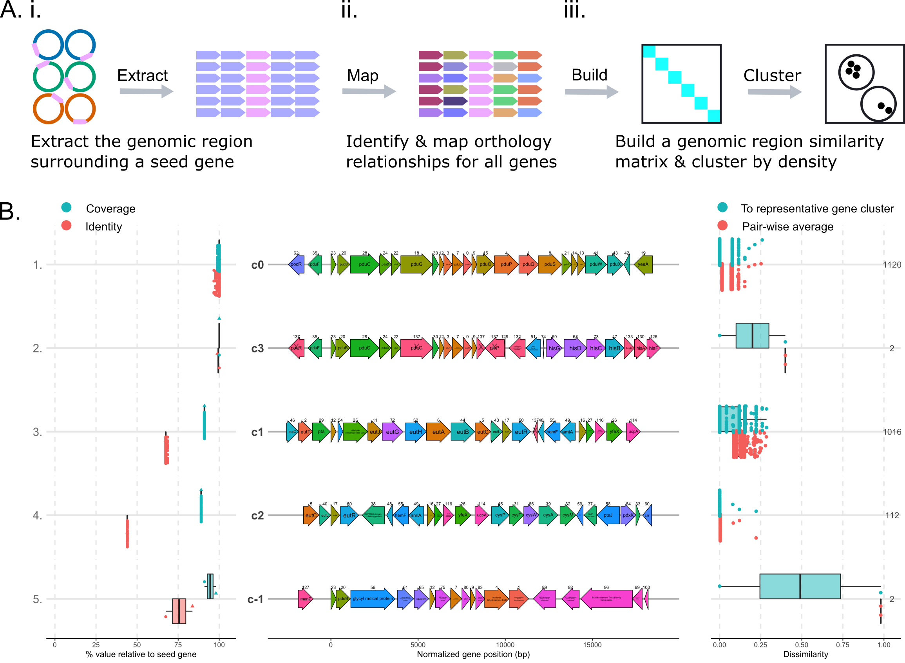

**GeneGrouper** is a command-line tool that searches a set of genomes for any gene cluster containing a gene of interest. All gene clusters are then binned into groups according to similarity in gene content. Qualitative and quantitative outputs provide a population-level understanding of how gene cluster groups are distributed and the variation in gene content within a group.


---



[See detailed explanation of overview figure](https://github.com/agmcfarland/GeneGrouper/wiki#why-use-genegrouper)

[See an example application of GeneGrouper](https://github.com/agmcfarland/GeneGrouper/wiki#example-application)

[See FAQs](https://github.com/agmcfarland/GeneGrouper/wiki/Frequently-Asked-Questions)

# Installation

```pip install GeneGrouper```

[See dependencies](https://github.com/agmcfarland/GeneGrouper/wiki/Installation-and-dependencies#requirements-and-dependencies)

[See creating a conda environment with all GeneGrouper dependencies installed](https://github.com/agmcfarland/GeneGrouper/wiki/Installation-and-dependencies#creating-a-conda-environment-with-all-dependencies)

# Inputs

### GeneGrouper has two required inputs:

1. A translated gene sequence in fasta format (with file extension .fasta/.txt)

2. A folder containing RefSeq GenBank-format genomes (with the file extension .gbff). [See options for how to download many RefSeq genomes at a time.](https://github.com/agmcfarland/GeneGrouper/wiki/Frequently-Asked-Questions#1-where-can-i-download-genbank-format-refseq-genomes-with-file-extension-gbff)

# Basic usage

#### Use `build_database` to make a GeneGrouper database of your RefSeq .gbff genomes
```
GeneGrouper -g /path/to/gbff -d /path/to/main_directory \
build_database
```

#### Use `find_regions` to search for regions containing a gene of interest and output to a search-specific directory
```
GeneGrouper -d /path/to/main_directory -n search_results \
find_regions \
-f /path/to/query_gene.fasta
```
#### Use `visualize` to output visualizations of group gene architectures and their distribution within genomes and taxa
```
GeneGrouper -d /path/to/main_directory -n search_results \
visualize
```

#### Use `visualize --visual_type group` to inspect a GeneGrouper group more closely 
```
GeneGrouper -d /path/to/main_directory -n search_results \
visualize \
--visual_type group
```
[See advanced usage examples](https://github.com/agmcfarland/GeneGrouper/wiki/Advanced-usage)

[See tutorial with provided example data](https://github.com/agmcfarland/GeneGrouper/wiki/GeneGrouper-tutorial-with-data)


# Outputs

Each ```region_search``` outputs:

**Four** tabular files with quantitative and qualitative descriptions of grouping results. 

**One** fasta file containing all genes used in the analysis.

```visualize``` outputs:

**Three** main visualizations provided if the ```visualize --visual_type main``` command is used. 

**One** additional visualization per group provided the ```visualize --visual_type group group_label <n>``` is supplied, where ```<n>``` is the name of the group label.  

[See complete output file descriptions](https://github.com/agmcfarland/GeneGrouper/wiki/Output-file-descriptions)

Each search and visualization will have the following file structure. Files under `visualizations` may differ.

```
├── main_directory
│   ├── search_results
│   │   ├── group_statistics_summmary.csv
│   │   ├── representative_group_member_summary.csv
│   │   ├── group_taxa_summary.csv
│   │   ├── group_regions.csv
│   │   ├── group_region_seqs.faa
│   │   ├── visualizations
│   │   │   ├── group_summary.png
│   │   │   ├── groups_by_taxa.png
│   │   │   ├── taxa_searched.png
│   │   │   ├── inspect_group_-1.png
│   │   │   ├── representative_seed_phylogeny.png
│   │   ├── internal_data
│   │   ├── seed_results.db
```

# Usage options

### Global flags
```
usage: GeneGrouper [-h] [-d] [-n] [-g] [-t]
                   {build_database,find_regions,visualize} ...

  -h, --help            show this help message and exit
  -d , --project_directory
                        Main directory to contain the base files used for
                        region searching and clustering. Default=current
                        directory.
  -n , --search_name    Name of the directory to contain search-specific
                        results. Default=region_search
  -g , --genomes_directory
                        Directory containing genbank-file format genomes with
                        the suffix .gbff. Default=./genomes.
  -t , --threads        Number of threads to use. Default=all threads.
```
### Subcommands

```
    build_database      Convert a set of genomes into a useable format for
                        GeneGrouper
    find_regions        Find regions given a translated gene and a set of
                        genomes
    visualize           Visualize GeneGrouper outputs. Three visualization options are provided.
                        Check the --visual_type help description.
```

### Subcommand flags
```build_database```
```
usage: GeneGrouper build_database [-h]

  -h, --help  show this help message and exit
```

```find_regions```
```
usage: GeneGrouper find_regions [-h] -f  [-us] [-ds] [-i] [-c] [-hk] [--min_group_size] [-re] [--force]

  -h, --help            show this help message and exit
  -f , --query_file     Provide the absolute path to a fasta file containing a translated gene sequence.
  -us , --upstream_search
                        Upstream search length in basepairs. Default=10000
  -ds , --downstream_search
                        Downstream search length in basepairs. Default=10000
  -i , --seed_identity
                        Identity cutoff for initial blast search. Default=60
  -c , --seed_coverage
                        Coverage cutoff for initial blast search. Default=90
  -hk , --seed_hits_kept
                        Number of blast hits to keep. Default=None
  --min_group_size
                        The minimum number of gene regions to constitute a group. Default=ln(jaccard distance length)
  -re , --recluster_iterations
                        Number of region re-clustering attempts after the initial clustering. Default=0
  --force               Flag to overwrite search name directory.
```

```visualize```

```
usage: GeneGrouper visualize [-h] [--visual_type] [--group_label]

  --visual_type      Choices: [main, group, tree]. Use main for main visualizations. Use group to
                     inspect specific group. Use tree for a phylogenetic tree of representative
                     seed sequencess. Default=main
  --group_label      The integer identifier of the group you wish to inspect. Default=-1
  --image_format     Choices: [png,svg]. Output image format. Use svg if you want to edit the
                     images. Default=png.
  --tip_label_type   Choices: [full, group]. Use full to include the sequence ID followed by group
                     ID. Use group to only have the group ID. Default=full
  --tip_label_size   Specify the tip label size in the output image. Default=2
```


# Citation

**Density-based binning of gene clusters to infer function or evolutionary history using GeneGrouper**

Alexander G McFarland, Nolan W Kennedy, Carolyn E Mills, Danielle Tullman-Ercek, Curtis Huttenhower, Erica M Hartmann

bioRxiv 2021.05.27.446007; doi: https://doi.org/10.1101/2021.05.27.446007

# Contact

Feel free to message me at alexandermcfarland2022@u.northwestern.edu or follow me on twitter [@alexmcfarland_](https://twitter.com/alexmcfarland_)! 
